# llm-translate

[](https://opensource.org/licenses/MIT)
[](https://nodejs.org/)
[](https://www.typescriptlang.org/)

CLI-based document translation tool powered by Large Language Models with glossary enforcement and quality-aware refinement.

## Highlights

- **Glossary-Enforced Consistency** - Domain-specific terminology is translated consistently across documents
- **Self-Refine Quality Loop** - Iterative improvement until target quality threshold is met
- **Structure Preservation** - AST-based processing maintains Markdown formatting integrity
- **Unix-Friendly** - Supports stdin/stdout for pipeline integration

## Installation

```bash
npm install -g llm-translate
```

Or run directly with npx:

```bash
npx llm-translate file README.md -s en -t ko
```

## Quick Start

```bash
# Set your API key
export ANTHROPIC_API_KEY=your-api-key

# Translate a single file
llm-translate file README.md -s en -t ko -o README.ko.md

# Use stdin/stdout pipeline
cat doc.md | llm-translate file - -s en -t ja > doc.ja.md

# With glossary for consistent terminology
llm-translate file guide.md -s en -t ko -g glossary.json -o guide.ko.md
```

## How It Works

llm-translate uses a **Self-Refine** translation algorithm:

```mermaid
flowchart TD
    A[📄 Input Document] --> B[1. PREPARE]
    B --> |Load glossary & extract text| C[2. TRANSLATE]
    C --> |Initial translation with glossary| D[3. EVALUATE]
    D --> E{Quality >= Threshold?}
    E --> |Yes| F[✅ Output Translation]
    E --> |No| G[4. REFLECT]
    G --> |Generate critique| H[5. IMPROVE]
    H --> |Apply suggestions| I{Max iterations?}
    I --> |No| D
    I --> |Yes| F

    style A fill:#e1f5fe
    style F fill:#c8e6c9
    style E fill:#fff9c4
    style I fill:#fff9c4
```



**Quality Evaluation Criteria:**

| Criteria | Weight | Description |
|----------|--------|-------------|
| Semantic Accuracy | 40% | Meaning preservation from source |
| Fluency | 25% | Natural expression in target language |
| Glossary Compliance | 20% | Correct use of glossary terms |
| Format Preservation | 15% | Markdown structure integrity |

## CLI Usage

### `llm-translate file <input> [output]`

Translate a single file.

```bash
# Basic usage
llm-translate file guide.md -s en -t ko -o guide.ko.md

# With glossary
llm-translate file doc.md -s en -t ja -g ./glossary.json

# Dry run (preview without API calls)
llm-translate file doc.md -s en -t ko --dry-run

# JSON output format
llm-translate file doc.md -s en -t ko --json

# Adjust quality threshold
llm-translate file doc.md -s en -t ko --quality 90 --max-iterations 5

# Verbose output
llm-translate file doc.md -s en -t ko -v
```

**Options:**

| Option | Description |
|--------|-------------|
| `-s, --source-lang <lang>` | Source language code (required) |
| `-t, --target-lang <lang>` | Target language code (required) |
| `-o, --output <path>` | Output file path |
| `-g, --glossary <path>` | Path to glossary JSON file |
| `-p, --provider <name>` | LLM provider (default: claude) |
| `-m, --model <name>` | Model name |
| `-f, --format <type>` | Force format: markdown, html, text |
| `--quality <number>` | Quality threshold 0-100 (default: 85) |
| `--max-iterations <n>` | Max refinement iterations (default: 4) |
| `--chunk-size <tokens>` | Chunk size in tokens (default: 1024) |
| `--context <text>` | Additional context for translation |
| `--strict-quality` | Fail if quality threshold not met |
| `--strict-glossary` | Fail if glossary terms not applied |
| `--dry-run` | Preview without making API calls |
| `--json` | Output result as JSON |
| `--no-cache` | Disable translation cache |
| `-v, --verbose` | Verbose output |
| `-q, --quiet` | Suppress non-essential output |

### `llm-translate init`

Initialize project configuration.

```bash
llm-translate init
# Creates .translaterc.json with default settings
```

### `llm-translate glossary <subcommand>`

Manage glossary files.

```bash
# List all terms
llm-translate glossary list ./glossary.json

# List terms for specific language
llm-translate glossary list ./glossary.json -t ko

# Validate glossary file
llm-translate glossary validate ./glossary.json

# Add a term
llm-translate glossary add ./glossary.json "machine learning" --target ko:머신러닝

# Remove a term
llm-translate glossary remove ./glossary.json "machine learning"
```

## Configuration

Create a `.translaterc.json` file in your project root:

```json
{
  "version": "1.0",
  "languages": {
    "source": "en",
    "targets": ["ko", "ja", "zh"]
  },
  "provider": {
    "default": "claude",
    "model": "claude-haiku-4-5-20251001"
  },
  "quality": {
    "threshold": 85,
    "maxIterations": 4
  },
  "glossary": {
    "path": "./glossary.json",
    "strict": false
  },
  "chunking": {
    "maxTokens": 1024,
    "overlap": 150
  }
}
```

Configuration is loaded with this priority:
1. CLI arguments (highest)
2. Environment variables
3. `.translaterc.json`
4. Defaults (lowest)

## Glossary Format

The glossary enforces consistent translation of domain-specific terminology:

```json
{
  "metadata": {
    "name": "Technical Documentation Glossary",
    "sourceLang": "en",
    "targetLangs": ["ko", "ja"],
    "version": "1.0.0"
  },
  "terms": [
    {
      "source": "machine learning",
      "targets": {
        "ko": "머신러닝",
        "ja": "機械学習"
      },
      "context": "AI/ML domain terminology"
    },
    {
      "source": "API",
      "targets": {},
      "doNotTranslate": true
    },
    {
      "source": "frontend",
      "targets": {
        "ja": "フロントエンド"
      },
      "doNotTranslateFor": ["ko"],
      "caseSensitive": false
    }
  ]
}
```

**Term Options:**

| Field | Description |
|-------|-------------|
| `source` | Source term to match |
| `targets` | Translation map by language code |
| `doNotTranslate` | Keep source term for all languages |
| `doNotTranslateFor` | Keep source term for specific languages |
| `caseSensitive` | Case-sensitive matching (default: true) |
| `context` | Usage hint for LLM |

## Environment Variables

| Variable | Description |
|----------|-------------|
| `ANTHROPIC_API_KEY` | Claude API key |
| `OPENAI_API_KEY` | OpenAI API key |
| `OLLAMA_BASE_URL` | Ollama server URL (default: `http://localhost:11434`) |

## Docker Deployment

### Using Docker Compose (Recommended)

1. Create a `.env` file with your configuration:

```bash
OPENAI_API_KEY=sk-proj-your-api-key
UID=1000
GID=1000
```

or

```bash
echo "OPENAI_API_KEY=sk-proj-xxx..." > .env
echo "UID=$(id -u)" >> .env
echo "GID=$(id -g)" >> .env
```

2. Run the server:

```bash
# Start the server
docker compose -f docker-compose.prod.yml up -d

# View logs
docker compose -f docker-compose.prod.yml logs -f

# Stop the server
docker compose -f docker-compose.prod.yml down
```

3. Update to the latest image:

```bash
docker compose -f docker-compose.prod.yml pull && docker compose -f docker-compose.prod.yml up -d
```

### Using Docker Run

```bash
docker run -d --name llm-translate \
  -e OPENAI_API_KEY=your-api-key \
  -p 3000:3000 \
  -u $(id -u):$(id -g) \
  -v $(pwd)/.translate-cache/server:/app/cache \
  -v $(pwd)/.translaterc.json:/app/.translaterc.json:ro \
  ghcr.io/selenehyun/llm-translate:alpha serve --json --cors --no-auth --cache-dir /app/cache
```

### Server Options

| Option | Description |
|--------|-------------|
| `--port <number>` | Server port (default: 3000) |
| `--host <string>` | Host to bind (default: 0.0.0.0) |
| `--no-auth` | Disable API key authentication |
| `--cors [origins]` | Enable CORS (optionally specify allowed origins, comma-separated) |
| `--json` | Use JSON logging format |
| `--cache-dir <path>` | Cache directory path |

**CORS Examples:**

```bash
# Allow all origins
serve --cors

# Allow single origin
serve --cors "https://example.com"

# Allow multiple origins
serve --cors "https://example.com,https://app.example.com"
```

## Supported Formats

| Format | Status | Notes |
|--------|--------|-------|
| Markdown | Stable | Full AST-based processing, preserves code blocks, links, tables |
| Plain Text | Stable | Direct translation |
| HTML | Planned | Coming soon |

## Exit Codes

| Code | Meaning |
|------|---------|
| 0 | Success |
| 1 | General error |
| 2 | Invalid arguments |
| 3 | File not found |
| 4 | Quality threshold not met (with `--strict-quality`) |
| 5 | Provider/API error |
| 6 | Glossary validation failed |

## Development

### Prerequisites

- Node.js 20+
- npm or yarn

### Setup

```bash
# Clone the repository
git clone https://github.com/selenehyun/llm-translate.git
cd llm-translate

# Install dependencies
npm install

# Build
npm run build

# Run in development mode
npm run dev
```

### Scripts

```bash
npm run build       # Build with tsup
npm run dev         # Watch mode
npm test            # Run tests
npm run test:run    # Run tests once
npm run typecheck   # TypeScript check
npm run lint        # ESLint
```

### Project Structure

```
src/
├── cli/              # CLI entry point and commands
│   ├── commands/     # file, dir, init, glossary commands
│   └── options.ts    # Shared CLI options
├── core/             # Translation engine
│   ├── engine.ts     # Main translation orchestrator
│   ├── agent.ts      # Self-refine translation agent
│   ├── chunker.ts    # Semantic document chunker
│   └── evaluator.ts  # Quality evaluation
├── parsers/          # Format-specific parsers
│   └── markdown.ts   # Markdown AST parser
├── providers/        # LLM provider adapters
│   ├── interface.ts  # Provider interface
│   ├── registry.ts   # Provider registry
│   └── claude.ts     # Claude provider
├── services/         # Supporting services
│   ├── glossary.ts   # Glossary loading and resolution
│   └── config.ts     # Configuration loader
├── types/            # Type definitions
└── utils/            # Utilities
```

## Roadmap

### v0.1.0 (Current)
- [x] Single file translation
- [x] Claude provider
- [x] Markdown parser with structure preservation
- [x] Self-Refine quality loop
- [x] Glossary enforcement
- [x] stdin/stdout support
- [x] Configuration system

### v0.2.0 (Planned)
- [ ] OpenAI provider
- [ ] Ollama provider (local LLMs)
- [ ] HTML parser
- [ ] Translation cache
- [ ] Batch directory processing

### v0.3.0 (Future)
- [ ] Parallel file processing
- [ ] Progress reporting
- [ ] MCP server integration

## Contributing

Contributions are welcome! Please read our contributing guidelines before submitting a PR.

1. Fork the repository
2. Create your feature branch (`git checkout -b feature/amazing-feature`)
3. Commit your changes (`git commit -m 'Add amazing feature'`)
4. Push to the branch (`git push origin feature/amazing-feature`)
5. Open a Pull Request

## License

MIT License - see [LICENSE](LICENSE) for details.

## Acknowledgments

Built with:
- [Vercel AI SDK](https://sdk.vercel.ai/) - LLM integration
- [Commander.js](https://github.com/tj/commander.js/) - CLI framework
- [unified/remark](https://unifiedjs.com/) - Markdown processing
- [Zod](https://zod.dev/) - Schema validation
